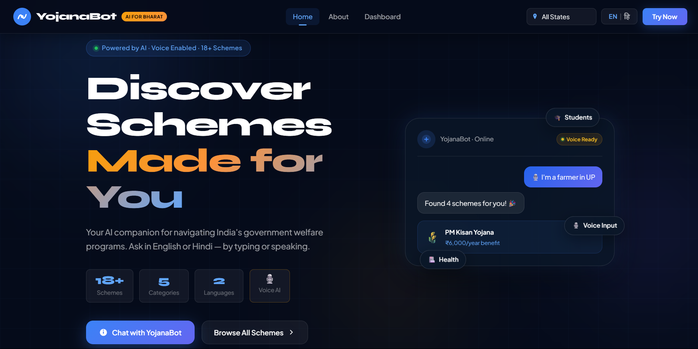
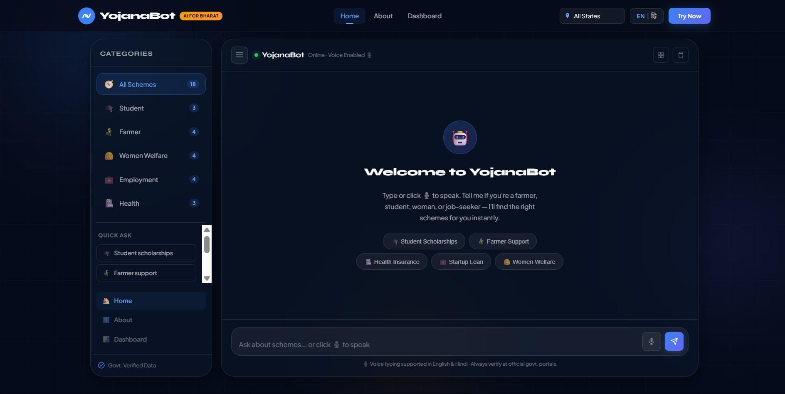

# Multi-Language Scheme Discovery Chatbot (YojanaBot)

## 🌐 Live Demo
👉 https://kusgr.github.io/yojanabot-ai-bharat/

## 🚀 Problem
Millions of Indians miss government scheme benefits due to lack of awareness and language barriers.

## 💡 Solution
A multilingual AI chatbot that helps users discover schemes based on their needs.

## ✨ Features
- Chat-based simple interface
- Hindi + English support
- Smart scheme recommendation
- Voice input support 🎤
- Clean modern UI

## 🛠️ Tech Used
- HTML, CSS, JavaScript
- JSON-based dataset
- Rule-based AI logic

## 👥 Team
- Kushagra Maurya (Full-Stack Developer)
- Samriddhi Srivastava (UI/UX Designer)
- Manya Pandey (Data Researcher)

## 📌 Impact
Bridges gap between government schemes and common citizens.

## 📸 Screenshots

### Homepage UI

### Chatbot Demo

---
Made for INNOVATHON 2026 🚀
